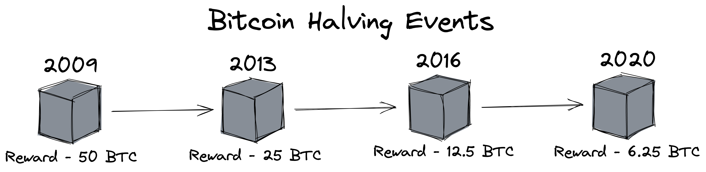
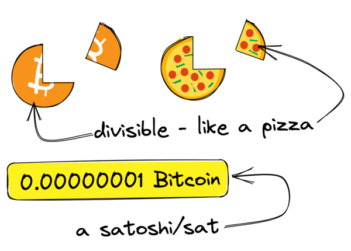
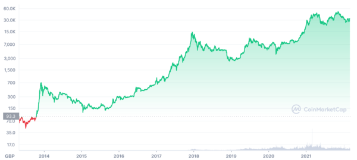

Hey friends 👋

Let’s talk about Bitcoin.

---

Over the last year or so, everyone has either been talking about Bitcoin or has at least heard of it by now.

*What is Bitcoin? Should I buy Bitcoin? Is Bitcoin a scam?*

These are all questions that have been asked (and more) by a lot of people when they first heard of Bitcoin.

Over the years I’ve had many conversations with people about Bitcoin; people who saw it as an amazing opportunity, people who thought it was a massive scam and those who just didn’t really understand it.

To me, Bitcoin (and cryptocurrencies in general) has always been an interesting topic.

So I wanted to use this newsletter issue to share with you what I think of Bitcoin and what I think more people need to be aware of.

**Note** - I won’t be covering the technical details of Bitcoin here and the following issue is one of my longer pieces. If you wanted a quick summary of what you need to know about Bitcoin, check out this thread I wrote on Twitter last year 👇



## Disclaimer

I should make this clear before going further…

**Nothing discussed here is financial advice.**

*This post is for educational and entertainment purposes only. Please don’t make financial decisions based on this newsletter issue.*

I’m not a financial advisor. I’m just a guy that is interested in personal finance (and by extension, cryptocurrencies).

### Bias

Another thing I should mention is that my option will be slightly biased. I own a small amount of Bitcoin, so I’ll be trying to show a balanced view here but I thought it was worth mentioning.

## What makes Bitcoin different?

Believe it or not, [Bitcoin was not the world’s first attempt at a cryptocurrency](https://www.investopedia.com/tech/were-there-cryptocurrencies-bitcoin/) but rather it was the first successful decentralised cryptocurrency to have taken off.

Bitcoin is an open-source decentralised peer to peer currency that had no central authority that controls.

I always like comparing it to the likes of email, because who owns email?

The answer is no one because it’s an open standard that other companies have built things on top of, but they don’t ‘own’ email because of this. The same can be said for Bitcoin.

In addition to that, there are a number of factors to Bitcoin’s success since its invention but there are five main factors that make Bitcoin valuable or desirable as a currency to people. Let’s have a look at each one in a bit more detail below…

## Scarcity

### Fixed Supply

Scarcity is the first factor that makes Bitcoin different from other currencies. Scarcity simply means that there is a limited supply or shortage of a certain thing. A lot of things have a limited supply if you think about it, oil, computer chips, gold, limited edition trainers, etc.

In Bitcoin’s case, there are a maximum number of Bitcoins that can ever exist. Bitcoin was hardcoded with a fixed supply of 21 million bitcoins.

This might sound like a lot but roughly 2.8 to 3.8 million bitcoins are said to already be lost and there are bitcoin wallets with hundreds if not thousands of bitcoins already in them.

This creates a limited supply of bitcoins in circulation right now and once all 21 million bitcoins have been mined, there will never be any new bitcoins.

Traditional currencies like the US dollar or the British pound sterling, don’t have a limited supply as more can be printed when needed. This is partly why traditional currencies lose value over time due to inflation.

Bitcoin on the other hand is not subject to inflation but rather deflation as creating new bitcoins becomes increasingly more difficult over time due to…

### Halving Events

What is a *“Halving Event”* you say?

The halving is something that currently happens roughly every 4 years. Currently, when a block is successful ‘mined’, the person (or machine) that mined this block is given a reward in bitcoins.

In 2009, this reward was initially set at 50 bitcoins. 4 years later it dropped to 25 bitcoins and in 2016 it dropped to 12.5 bitcoins per block. The last halving event was in 2020 and the reward now sits at 6.25 bitcoins per successfully mined block. The next halving event is expected to happen around 2024 when the block reward will drop to just 3.125 bitcoins.

The difficulty (or energy required) of mining these blocks does not decrease, so obtaining new bitcoins becomes harder due to the decreasing block reward.

>The reward of mining a block halves roughly every 4 years

These halvings help ensure a steady and predictable supply of new bitcoins, where the last bitcoin is expected to be mined around the year 2140.

Due to Bitcoin’s fixed supply along with these periodic halving events, the overall supply of new bitcoins decreases over time. Therefore a lot of people believe that the overall value of a bitcoin will increase due to this contrasted supply of new bitcoins.

## Durability

Durability is the ability to be able to withstand damage. Since bitcoins are not physical or digital objects, they can’t be destroyed and they don’t ‘wear down’ over time. Instead, the ownership of bitcoins is recorded in a public ledger called the blockchain.

The blockchain is a decentralised ledger with a copy of every single transaction that has taken place on the Bitcoin network. As long as you retain access to the bitcoin wallet (or more specifically the private keys), then you’ll always have access to your bitcoins.

Bitcoin is often compared to gold when discussing durability as, like gold, it can’t be destroyed and it also can’t be physically ‘lost’ because it’s not a physical object like gold.

Durability is a favourable quality in a currency, which is something Bitcoin provides.

## Portability

Bitcoins (and cryptocurrencies in general) are probably some of the most portable currencies we have today. Since they have no physical form, there’s no storage risk that comes with traditional currencies or gold.

Because Bitcoin is very portable, it’s relatively easy to send a large amount of money (or value) using the Bitcoin network without a middleman.

If you were to attempt the same with say a million dollars you would either have to use a trusted third party like a bank which could take a lot longer at sending such a large amount of money or you could move this money in cash which would be incredibly costly and risky.

With Bitcoin, on the other hand, you could ‘technically’ carry large amounts of bitcoins with you on your phone via a mobile wallet app or a USB stick and it wouldn’t ‘weigh’ you down the same way carrying a lot of coins or banknotes would.

Bitcoin nails portability thanks to the fact it’s fully digital.

## Divisibility

Bitcoin is extremely divisible, meaning you can send or receive tiny factions of a bitcoin very easily.

The smallest unit of bitcoin is a ‘sat’ or satoshi, which is one hundred millionth of a bitcoin, or 0.00000001 bitcoins.

>Bitcoins are divisible, like a pizza and a single unit of a bitcoin is called a satoshi or 'sat'

This allows bitcoins to be used for smaller transactions and even micro-transactions, such as tips, buying small things like coffees and so on. Most of these micro-transactions are made using a layer 2 solution called [The Lightning Network](https://lightning.network/) for faster and cheaper payments ⚡

## Fungibility

Bitcoin’s final factor is fungible, meaning each and every bitcoin is identical. Each of the 21 million bitcoins is exactly the same. Fungibility is a desirable trait within any currency, including cryptocurrencies like Bitcoin.

## The Future of Bitcoin

So now that we’ve explored the five factors that make Bitcoin different, let’s talk about what this means for Bitcoin going forward.

The popularity of Bitcoin is *likely* going to grow in the future. This doesn’t mean the price of Bitcoin itself is going to increase but rather we will likely see other companies and countries holding onto Bitcoin as a reserve of some kind.

There are actually [a few companies that now own and hold Bitcoin](https://bitcointreasuries.net/); MicroStrategy, Tesla, Block (formally Square), Coinbase and even one of the ‘big four’ accounting organisations, KPMG!



Country-wise, only one country has made Bitcoin legal tender and that’s El Salvador but some folks are speculating that other countries might look to do the same over the coming years.

So that begs the question…*should you buy Bitcoin?*

The answer (bearing in mind this isn’t financial advice) is maybe.

I personally think it depends on your individual circumstances…

For example, if you currently have little to no savings, I don’t think it’s a good idea to buy Bitcoin or any cryptocurrency and instead, you should focus on [building up an emergency fund](/archive/akashandmoney/emergency-funds), first.

If you’re someone that already has some savings/an emergency fund, then I think it makes more sense to [look into more traditional investments](/archive/akashandmoney/investing-101) that are less risky and [explore tax-efficient savings accounts](/archive/akashandmoney/interesting-isas) such as a Stocks and Shares ISA.

If you’ve already nailed the emergency fund, have a decent tax-efficient investment portfolio, have looked into [buying back your time](https://yougotthis.io/talks/buying-back-your-time) (optional - but I highly recommend it), only then would I really say it would be worth looking into Bitcoin as an investment (once again, *not. financial. advice.*).

Even at this point, I would say it’s probably best to only invest a small amount of your net worth/investment portfolio into Bitcoin. Bitcoin is still a relatively high risk as an asset class and extremely volatile.

I wanted to also discuss the risks and concerns that come with Bitcoin and cryptocurrencies because Bitcoin is not a perfect solution.

## Bitcoin Woes & Risks

### Volatility

Let’s talk about Bitcoin’s volatility first. As you might be aware, Bitcoin is highly volatile. Its price has fluctuated and more recently it’s lost 40% of its value since its last all-time high of $68,990 (around £51,780) in November 2021.

A store of value (often what Bitcoin is often referred to) does not lose 40% of its value in less than a year. If you had bought Bitcoin at this all-time high, it would be devastating to see that you’ve lost 40% of your money in less than 6 months.

That being said…volatility does bring opportunities. Looking at the longer term, Bitcoin has slowly been increasing in value over the last 12 years.

>Bitcoin's price history (source - coinmarketcap.com)

Seeing these types of gains or profit require being able to stomach large drops without panic selling and **there isn’t a guarantee that Bitcoin will continue to increase in value** over the next decade and beyond as it has done in the past.

This is why I would recommend focusing on savings/emergency funds first, and then traditional investments before looking into volatile cryptocurrencies. There’s just still a lot we don’t know when it comes to what will happen to cryptocurrencies in the future.

That leads me to my next point now…

### Fighting FOMO (Fear Of Missing Out)

One thing I’ve seen increase along with Bitcoin’s coverage in the media is the fear people have of feeling like they’re missing out. Which in turn causes them to panic buy Bitcoin and other cryptocurrencies without really understanding it and then panic selling when they see massive price swings, losing their money in the process. The news coverage around Bitcoin’s all-time high price tends to have this effect the most, and the people who buy Bitcoin at this all-time high and usually the first to get stung when Bitcoin tumbles down in price.

I think this issue can be summarised to just this:

**People get too emotional when it comes to any form of investments**

When it comes to other things, we’re generally a lot more level headed and reasonable.

Like, you wouldn’t panic-buy a new car because everyone else is buying that exact same car? Or what about a new phone?

You’d probably want to do your research first, understand why these items are sought after and what they offer.

Here’s another example. Over 2021, the *S&P 500 hit an all high 70 times throughout the year*…how many times did you panic buy the S&P 500 during 2021?

For most people reading this, they likely didn’t. Instead, they might have been fixated on what the media was saying about Bitcoin.

One way I fight FOMO is by spending a lot of time researching and learning about what I want to invest in, all while ignoring the price of the asset while I do so. Depending on what I’m looking into, this process can take a few months and in the end, I might just decide not to invest in something because of something I found during my research.

### Replacing traditional currencies

Some folks that support Bitcoin see it as something that might replace traditional fiat currencies like the dollar and the pound sterling in the future.

I’ll be honest… I don’t think this will ever happen. No government would want to rely on a currency they are not in control of as their main currency. Fiat currencies in western nations also come with some level of protection on your money such as the FSCS protection scheme in the UK or the FDIC deposit insurance in the US. Bitcoin (and cryptocurrencies as a whole) do not come with such protection.

Another reason I don’t think we’ll see cryptocurrencies like Bitcoin replace traditional currencies is that cryptocurrencies exclude people who are not technologically literate.

My grandparents struggle using a smartphone, let alone mobile banking. I can’t see them ever getting crypto wallets and fully understanding the risks that come with it. I’m sure there are large groups of people who will likely struggle with cryptocurrencies due to this.

I do however think Bitcoin and other cryptocurrencies that offer ‘DeFi’ (Decentralised Finance) will offer an alternative to traditional markets, and there is likely a future for that, but it won’t be replacing any traditional markets any time soon.

### Energy concerns

One of the biggest outcries you’ll see around Bitcoin is its high energy usage. I won’t go into too much detail here but I will say that Bitcoin does use a lot of energy and that energy usage is only going to increase. That being said, however, I think people get Bitcoin’s energy consumption confused with its carbon emission output.

It’s estimated that Bitcoin currently uses around 0.55% of global electricity production (roughly the equivalent amount of energy a small country uses). The exact percentage varies but it is suggested that a large amount of the energy used by Bitcoin miners is generated using renewable energy sources, hydropower being one of the largest sources of energy for Bitcoin. Using a renewable energy source will mean that there is minimal carbon output.

Other cryptocurrencies have found more energy-efficient ways of running their networks, one of such is [Ethereum](https://ethereum.org) which plans to move away from Proof of Work (what Bitcoin uses) to Proof of Stake.

Bitcoin will likely not change how it works. It is designed to sacrifice electrical energy to generate/mine new bitcoins. This is its ‘cost’ of creating new bitcoins. Removing this ‘cost’ would also remove/reduce the value of Bitcoin.

There’s not really much I can add to this. I just wanted to point it out and make sure you were aware of it.

## Security

Security plays a major part in cryptocurrencies. Specifically speaking, cryptography is critical in what makes or breaks a *cryptocurrency*. In fact, it’s even mentioned in the name!

**Crypto**currency

A lot of people get really excited for the ‘*currency*’ part of cryptocurrency but bear little attention to the ‘cryptography’ part of it.

Cryptocurrencies are all about decentralisation and ‘Being your own bank’ and I have some thoughts around this.
Banks exist for a reason. They help the average person keep their money secure and outsource the need for having to think about how you keep your money safe.

If I’m being brutely honest. I don’t think the majority of people understand the difficulty that comes with being your own bank. The security of your money is ultimately your responsibility. If you haven’t done a good job of securing your crypto wallet, that falls on you.

> Not your keys, not your wallet

This is a famous phrase you’ll hear among the crypto community. Holding your cryptocurrency on an exchange can be risky due to exchange hacks. It’s happened in the past and [I doubt we’ve seen the last of exchange hacks](https://crystalblockchain.com/articles/the-10-biggest-crypto-exchange-hacks-in-history/).

At the same time, being your own bank is not easy. There are countless stories of people who have lost fortunes where they did own their own keys.

There’s one famous story of [a man in the UK who accidentally threw away a hard drive that contained the private keys to around 7,500 bitcoins](https://www.bbc.co.uk/news/uk-wales-55658942) 😱

Then there’s the fact that transactions made using cryptocurrencies are irreversible. If you happen to get scammed out of your cryptocurrency, there’s no way of getting it back. There are no chargebacks, no refunds, nothing.

Scammers have plagued cryptocurrencies for a long time and if you fall for one, there’s not much that can be done. I would advise being aware of how these scams work and how you can protect yourself against such scams.

I went and found two great resources for getting a basic understanding of crypto security.

The first is a thread by Bobby Ong (the co-founder & COO of [CoinGecko](https://www.coingecko.com/)) which covers some basics at a very high-level overview.



The second is [a blog post](https://skerritt.blog/wallet-security/) covering crypto wallet security, put together by a friend of mine! I’ve personally gone through this post and found it really easy to follow along, all while explaining complicated wallet security topics. There’s a great little summary at the end that summaries everything pretty well but I would highly recommend giving [the full post a read](https://skerritt.blog/wallet-security/)!

I will add however, it would be a good idea to consider getting a hardware wallet if you are storing large amounts of bitcoins - There are other great guides and resources around this topic online.

Personally, I’m a fan of the [Ledger hardware wallet devices](https://www.ledger.com/). If you wanted to test out an app-based software wallet in the meantime, the open-source [BlueWallet](https://bluewallet.io/) is a great simple first wallet with some advanced features built-in.

## Further reading

Just before I wrap up this post, I thought I’d share four resources you might want to look into if you wanted to read up more on Bitcoin:

* [The Bitcoin Whitepaper](https://spiral.xyz/bitcoin.pdf) (The original Bitcoin whitepaper)
* [The Bitcoin Standard](https://www.amazon.co.uk/Bitcoin-Standard-Decentralized-Alternative-Central/dp/1119473861/) (Highly recommended book)
* [Why Bitcoin Makes Sense](https://michaelmcguiness.com/essays/why-bitcoin-makes-sense) (An essay on the pros of Bitcoin)
* [Bitcoin: The Future, or a World’s Greatest Scam](https://www.youtube.com/watch?v=4ByO8ym-iF8) (A great explanation from James Jani in video format)

Of course, there are a lot more resources that I haven’t been able to list here.

## Summary

If you made it this far, great! Thanks for sticking around 😁

Here’s my summary - Regardless of if you love or hate Bitcoin and what is it. Just like marmite, Bitcoin is here to stay.

There are a number of countries with inadequate payments infrastructure and currency stability issues (such as hyperinflation) where Bitcoin could provide some stability.

The majority of us are very fortunate and privileged to live in parts of the world where we have these types of infrastructure in place and don’t have to worry about currency stability issues that other places deal with.

Additionally, there will likely be a lot of interesting and exciting projects being developed around Bitcoin now that large companies (and even countries) have taken such an interest in Bitcoin.

Price predictions - Easy, don’t bother. Almost everyone that has made a production of what price Bitcoin will be has been wrong. No one knows what will happen, but I’m certain Bitcoin will continue being the rollercoaster that it’s so commonly known for the foreseeable future.

There is, of course, so much more that I wanted to write about when it comes to Bitcoin, but I’m going to have to leave it like this, for now, to avoid this becoming a dissertation on Bitcoin.

That’s all from me for today!

I’m planning on writing up something on Ethereum next and will drop a thread on Twitter as well, so follow me on Twitter if you haven’t already.

I’ll see you next time 👋