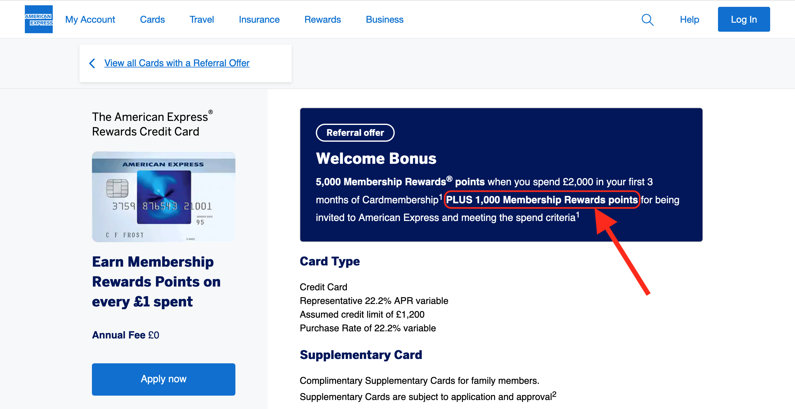

Hi everybody 👋

Hope you've all been well! 

For this week's issue of Akash & Money, I wanted to share how I've used credit cards to my advantage to earn points and why I spend my money via a credit card and not a debit card.

**Before going any further I would just like to remind you all that this isn't financial advice and that all information, opinions and suggestions are for educational and entertainment purposes.**

I should add that this issue won't cover the basics around credit cards and rather I'll be focusing on the "reward credit cards" rather than standard credit cards, 0% credit cards or [section 75](https://www.moneysavingexpert.com/reclaim/section75-protect-your-purchases/). If you happen to be someone that carries a credit card balance month to month, then earning points should be a low priority and instead, you should focus on paying down this debt or any other short term debt you may have - **The points earned do not outweigh the interest rate of any debit so please bear that in mind. **

Ok, but what’s the point of points? (see what I did there 😏)

## Credit card rewards/points

Ok, let's kick-off! 

Whenever you make a transaction using either cash or a card, most cards do not offer you anything at all for making those transactions. Reward credit cards offer a reward for using them instead of your other payment options where you usually earn a point per £1 you spend on the card. If you look back at how much you spent month to month, you can roughly work out the number of points you could be earning on your purchases and these points can stack up over several years and be used on things like flights, cash back or credit statements. 

Over the last three years, I've managed to collect just over 70,000 points across American Express Membership Reward Points, British Airways Avios and Virgin Points. Most credit cards also offer a signup bonus with a few thousand points to start with either if you hit a spending goal or by making a single transaction on the card. 

## Being responsible with credit cards

Now earning rewards is great but you'll tend to find that credit cards like this tend to have a higher interest rate than other credit cards. If you end up carrying a balance because you're unable to pay off a credit card in full each month, then the points end up costing you more than what they are worth. It can be really easy to justify a frivolous purchase because "I can pay it off after I get paid" and it's this type of mentality can make it a lot harder to budget and can lead to overspending money you might not have. This is why I use a feature from my main bank and carefully plan my spending to overcome this. 

### Welcome bonuses

Before signing up for any of these credit cards, the first thing I did was see if I had any planned large purchases coming up. Reward credit cards often tend to have a **welcome bonus** but the catch is that you only get the bonus once you spend a certain amount on the credit card. For one of my cards, the bonus was an extra 5,000 points when you spent £2,000 within the first three months. Around the time of getting my first rewards card, I was looking to purchase a new phone for my mum and book a return trip flight for my family. Together these purchases were over £2,000 and they were all going to be made in the next three months so I signed up for a credit card and managed to hit the spending goal for the bonus without spending more than I was already planning to spend. 

One of the first mistakes you can make when signing up for these credit cards is *thinking you need to hit the spending goal for the bonus*, which again, leads to overspending. By strategically planning your spending you can avoid this entirely and just spend the amount you were already planning on spending. If you don't have any large purchases coming up just yet then it might be a good idea to hold off from signing up for a rewards credit card if you want the welcome bonus (hint - you should want the bonus).

Additionally, you can sometimes get a slightly bigger signup bonus by using a referral link to sign up for one of these credit cards. The extra bonus points vary per card but for example, the referral bonus for the Amex rewards credit card is 6,000 Membership Reward points (1,000 extra) and 22,000 Membership Reward points for the Amex gold card (2,000 extra). The referrer also gets some extra points as an incentive. I’d recommend asking any of your friends and family first to see if they have a referral link and if not you can always email myself for one as well.

 
*^ An example of a referral welcome bonus on the American Express Rewards Credit Card*

### Paying off credit cards 

The first thing I do is treat my credit cards like debit cards. If I don't have enough in my current account to pay for something then I can't buy it via a credit card. The other thing I do is pay my credit cards off in full each month. I do this by setting up a direct debit for each card linked to my bank account. Monzo has a unique feature where you can pay your direct debits from pots which I use to do this.

Using this feature I set up a pot for each credit card and link the direct debit to them. Now, when I do pay for things on my credit card I've got into a habit of moving the exact amount of money from my main account over to my credit card pot. Then, when the direct debit is due, the money is withdrawn from the pot and used to pay the direct debit automatically. Using this, I can stick to my budget and also reap the benefits from credit cards without overspending since the money needs to be in my account first to be moved over to the pot to pay off the credit card.

*^ The pot I set up to pay my American Express Rewards Credit Card direct debit*

### Fees

The first fee you want to avoid is the interest rate. You can avoid this by simply paying your balance in full every money. The method I use above is my preferred way and I highly recommend setting up a direct debit to have the balance paid off in full.

There are often other fees as well for making transactions using reward cards abroad and for making withdrawals at ATMs. I'd suggest avoiding using credit cards for these types of transactions and instead, use a fee-free debit card.

## My credit cards

Over the years I've had a number of credit cards. At the moment I currently have three point-earning cards that I use for my day to day spending. Between these three cards, I've managed to rack up over 70,000 points across them. 

### American Express Rewards Credit Card

The first, and the main credit card that I use is the [American Express Rewards Credit Card](https://www.americanexpress.com/uk/credit-cards/rewards-credit-card/?linknav=uk-amex-cardshop-allcards-learn-RewardsCreditCard-carousel). It has no annual fee and earns 1 Membership Rewards point per £1 spent on the card. These points are the most versatile out of the three types I collect. There are a lot of different ways you can spend them such as a credit statement on your credit card bill, gift vouchers (e.g. Amazon) or (and my favourite) airline air miles across a number of airlines. These points never expire as long as you keep a Membership Rewards point earning card open. To date, I hold just over 40,000 Membership Rewards points on my card and I don't plan on using them just yet.

### British Airways American Express Credit Card

Before the Amex rewards credit card was available in the UK I actually used the [British Airways Credit Card](https://www.americanexpress.com/uk/credit-cards/ba-credit-card/?linknav=uk-amex-cardshop-allcards-learn-BritAirwaysAmexCC-carousel) for most of my day to day spending. This card also has no annual fee and at the time of when I got my BA (British Airways) Amex card I just used to collect Avios air miles (1 point per £1 spent) in the hopes of using these air miles for business class flights. Head for Points is a great website that explains [how to earn Avios](https://www.headforpoints.com/the-beginners-guide-to-collecting-avios-points/) as well as [what you can spend them on](https://www.headforpoints.com/2020/04/06/how-do-you-book-flights-using-avios-points/).
There is one issue with collecting just Avios points and it's that [they expire if you do not collect, spend, purchase or share at least one Avios point](https://www.britishairways.com/en-gb/executive-club/collecting-avios/avios-expiry-rules) every 36 months. This isn't too terrible, however, it can be easy to forget and you could end up losing all your Avios air miles. 
That's why I have one monthly card subscription paid from my BA credit card and this keeps my 25,000 plus Avios air miles valid indefinitely.

### Virgin Atlantic Credit Card

My final main credit card is the [Virgin Atlantic Credit Card](https://uk.virginmoney.com/cards/products/vaa-cards/). This Mastercard credit card has no annual fee but earns a slightly lower rate of 0.75 points per £1 spent and 1.5 points for every £1 spent via Virgin Atlantic or Virgin Holidays. I treat this card more as a backup card for places that don't accept American Express. This is one of my most recent cards and a card I do not use that often, so I only have just over 5,000 points on this card - 5,000 of those points coming from the signup bonus before that was removed earlier this year.

## What I would do differently 

If I could start all over again the main change I would make is signing up for the [Amex Preferred Rewards Gold Credit Card](https://www.americanexpress.com/uk/credit-cards/gold-credit-card/) first via a referral link to get a welcome bonus of 22,000 points instead of the Amex rewards credit card. You pay no annual fee for the first year you have an Amex gold card, so towards the end of that year, if I didn't find myself utilising the other benefits that came with the gold card I would downgrade to the rewards card to retain all the points I earned and to keep earning more points while still paying no annual fee. [The Points Guy's Beginner Guide](https://thepointsguy.co.uk/guide/beginners-guide-tpg-uk/) is also a great resource for learning how to maximise the most out of reward credit cards.

That's all for this issue, I hope it was informative and insightful around how reward credit cards work! If you would like a referral for one of American Express cards I mentioned and you aren't able to use anyone else's referral first, you can email me and I can share mine with you 😊