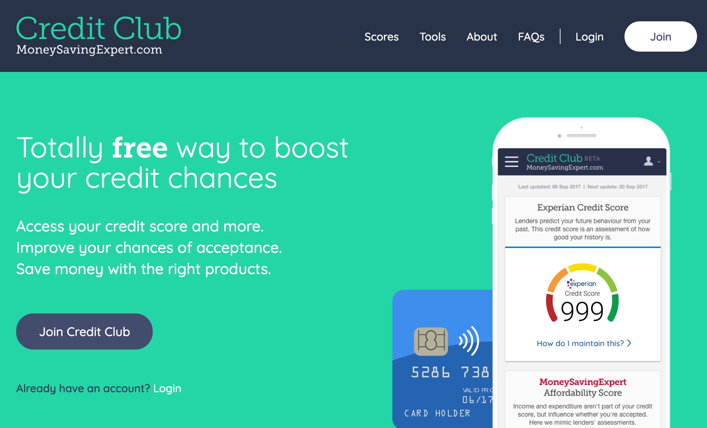
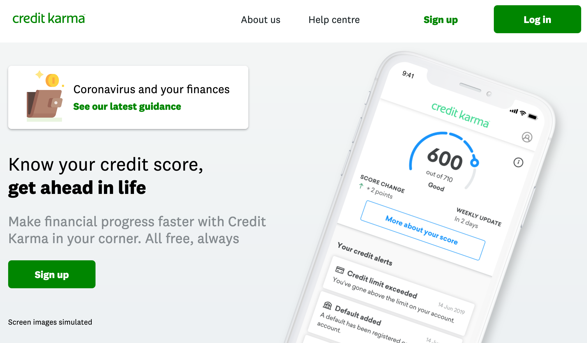
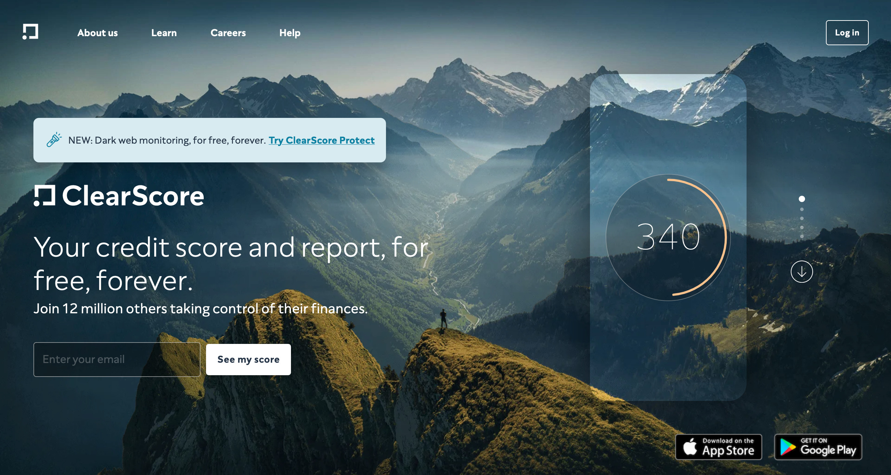

Hey there lockdown crew 👋

Last time I went over some of the [types of scams you might come across on social media](/archive/akashandmoney/social-scammers). Given we're in a second lockdown now, there's a chance you might start seeing some of these scams re-emerging so if you haven't already I would recommend giving the last issue a look over.

In this issue I’m covering credit scores and why you should think about yours. I want to avoid sharing what you [might have already come across online](https://twitter.com/ikeeyah_/status/1179145024602329088) but rather expand share what I've learnt from my own experience trying to understanding my credit score. 

Let's go 🏃‍♂️💨

## Credit Scores 101

Let's do a quick 101 on what credit scores are. Credit scores are used by lenders as a way to measure your "reliability" when they decide if you can qualify for certain lending products (e.g. credit cards, loans, mortgages, etc.)

Lenders want to avoid lending money to people that they think are unlikely to pay it back. If your credit score is on the low side, they could flat out reject your application or they might consider you for their products but with a higher interest rate, which means you end up needing to pay back more than those with a higher credit score. 

Not all credit scores are the same, and lenders do not use the same one. You have three different credit scores in the UK due to the three credit agencies in the UK; **Experian**, **Equifax** and **TransUnion**. These three agencies provide your credit report to lenders to help them make accurate decisions regarding their lending products. 

## The three agencies

There's a lot of misunderstanding around how credit scores work and several [rumours and myths](https://www.experian.com/blogs/ask-experian/credit-education/faqs/credit-myths/) as well which have scared people into not checking their credit score. Checking your credit score does not affect your credit score and you can check it as often as you want (it might not update daily). I use the following apps and websites to help me keep a track of my mine👇

### Experian / Money Saving Expert’s Credit Club

 
To check my *Experian credit score*, I used to use [Experian\'s credit score checking service](https://www.experian.co.uk/) but I found that I wasn't able to view my whole credit report without paying for something called "CreditExpert" which costs a staggering £15 a month! 

I ended up finding a tool by MoneySavingExpert called [Credit Club](https://www.moneysavingexpert.com/creditclub/), which shows you the same Experian credit score and full credit report for free and have been using this since without any issues ✨

### CreditKarma
 

The next app/website is called [Credit Karma](https://www.creditkarma.co.uk) and this one allows you to view your *TransUnion credit score* and file. Unlike Experian however, this score only goes up to 710 instead of 999. This isn't something to worry about as this is just how TransUnion calculates your score. Out of the three apps I use, this one is my favourite, the app and web UI has a clean and simple look to it.

### ClearScore
 

And finally, [ClearScore](https://www.clearscore.com/) is the one out of the three that allows you to view your Equifax credit score and file. It also has a handy feature called "Protect" which checks if your linked email account has been involved in any data breaches and warns you if any of your passwords have been leaked online.

## What I did
Surprisingly when I first checked my credit scores across these services I found that it was pretty high. There were three main things I did from when I was younger that positively impacted my credit score without even realising it. 

### Paying my phone bill ☎️
Around the age of 19, I started paying for my phone bill via direct debit. This shows lenders that I was able to pay a bill on time and with no issues for the length of time that I had this bill.  

### Registering on the electoral roll 🗳
I also registered to vote a few years before this. Something you might not know is that you can register to vote at the age of 16! If you haven't you can do this on the government website via [this link](https://www.gov.uk/register-to-vote) which takes roughly 5 minutes and provides another positive impact on your credit score. 

### Getting a credit card 💳
Ok, this option isn't for everyone - Some people might just want to avoid credit cards but if you end up taking one up, using it a bit, and pay it off in full on time every month then again this shows lenders that you are reliable. I got offered a student credit card with a £500 limit along with my student bank account and honestly, for most of the first year, I forgot I even had it. I started using it a bit more after that, putting roughly £50 a month of my spending on it and paying that off in full each month. By doing this I also maintained a *low utilisation* of my credit limit by keeping my credit usage at around 30% or less of my limit. 

All three of these things when combined gave lenders a good understanding of how I managed my money and brought up my score without really doing much. These led to being accepted for other lending products like my American Express credit cards and an overdraft (the latter being something I don't use and only really have for an emergency), which further builds a clearer picture of my credit history. 

Having a good credit score and credit history can help you secure a better interest rate (remember where we talked about measuring reliability) for large loans such as a mortgage. 

Checking your score also helps you spot anything fishy on your account, such as a credit card you never took out - Using these same services you can usually report something like this and they'll be able to investigate things like that for you. 

That's all for this email and I hope that this is a great introduction to credit scores for you. In the next issue, I'll go over credit cards and how I use mine to get a ton of points, air miles and cashback without paying anything extra fees or costs.