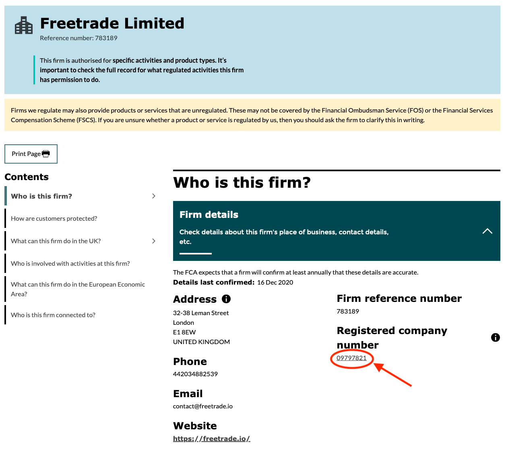
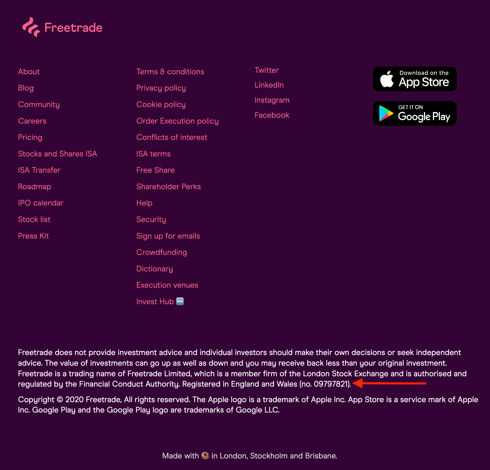

Hello there 👋

It’s been a while but good news, I’m back! 😎

First of all - apologies for not sending this out sooner. I got caught up in some other stuff but to make up for it I’m (finally) covering investing and everything you need to know as a beginner (or as I like to call it - “What I wish someone told me before I started”). 

Ok, disclaimer time - **This isn’t financial advice and everything discussed here is for educational and entertainment purposes only. If you are looking for financial advice, you should find a [qualified and registered financial adviser](https://www.citizensadvice.org.uk/debt-and-money/getting-financial-advice/).**

The last 12-18 months in the stock market have been a series of ups and downs and new investors have been pouring in thanks to low-cost investment platforms like Freetrade and Trading 212 in the UK and Robinhood, Fidelity and TD Ameritrade in the USA. 

I should also make this clear now before you read further - I’m not going to recommend a certain stock, share or anything for you to invest in. Instead, I want to share the benefits that come with investing, some easy ways to get started and some of the risks that are not talked about enough in my opinion (I’m looking at you, sponsored/promoted TikTok videos 👀). 

## Why you should invest 💭

So first and foremost - Investing lets you grow your money, and usually at a faster rate than what a savings account can offer you. Compound interest plays a large part in this and it can be hard to understand so let’s use a hypothetical example here to demonstrate this.

Let’s say Tom has £10,000 and wants to grow this money over time. After a quick search online, Tom finds that the highest rate on an easy access savings account is 0.41%. If he left his money in this account for ten years and received the same interest rate over this time then Tom would have roughly £10,417.65 after these ten years - He made a total of £417.65 in interest.

Now let’s see what would happen if Tom invested this money instead. According to Goldman Sachs “[the average stock market return for 10 years is 9.2%, for the past 140 years.](https://www.businessinsider.com/personal-finance/average-stock-market-return).” So we’ll be using 9.2% as our yearly interest rate here (note - historical data is not an indicator of future performance) and imagine this is the rate Tom gets on his money over the next 10 years. At the end of these ten years, Tom would roughly have £24,111.62! That’s a gain of £14,111.62 and more than double what he started with. 

CNBC Make It recently also put together a great video that demonstrates how powerful compound interest is. It’s just over 6 minutes long but I think it’s worth a watch 👇



Ok, now the second key reason why you should consider investing, is because of **inflation**.

I’ve mentioned this briefly before in a [past newsletter issue](/archive/akashandmoney/interesting-isas) and essentially what it means is that the value of your money will go down and you’ll find that the price of things like food, houses and wages will increase over time. Typically countries want the rate of inflation to be around 2% a year, to encourage spending, ensure stability and help plan for the future. [The Bank of England has a handy page](https://www.bankofengland.co.uk/monetary-policy/inflation) that explains inflation and the downsides to both a higher rate of inflation and a lower rate of inflation. They also have an [inflation calculator](https://www.bankofengland.co.uk/monetary-policy/inflation/inflation-calculator) you can use to see how the value of money has changed over time due to inflation. 

With that in mind, investing can you retain the value of your money by allowing it to grow at a faster rate than the rate of inflation (this will ultimately depend on what you invest in exactly). 

Want another reason to invest? Those gains you make can be **100% tax-free** - thanks to stocks and shares ISAs. 

Let’s go back to the example with Tom before. If he invested his £10,000 using a stocks and shares ISA and ended up with £24,111.62, he could withdraw all of that from his ISA account (minus any fees) and not need to pay a penny in tax on that. If he had used a general investment account (GIA) then he’d need to pay some tax, specifically [Capital Gains Tax](https://www.gov.uk/capital-gains-tax). Let’s say he also earns £38,600 a year (the UK average salary). Using [this capital gains tax calculator](https://taxscouts.com/calculator/capital-gains-tax/) (a handy free tool) he'd need to pay roughly £181 if he withdrew all his money today. Now that isn’t a lot in this example but it can be a lot more the longer you leave your money invested to grow. Let’s say Tom invested his money for 25 years instead of 10 years then he’d have made a gain of £80,274.68 and would need to pay around **£12,428 in capital gains tax** - a tax bill he could avoid entirely if he invested using a stocks and shares ISA instead. 

So this sounds great, right? Well, there are a few things you should know before you start investing.

## Before you invest ✋

### Emergency fund 🚨

I don’t think this is talked about enough, but **please have an [emergency fund](/archive/akashandmoney/emergency-funds)** before you look into investing your money. The value of your investments can go down as well as up so it’s highly recommended that you do not invest money that you need in the short term. It’s a good idea to have a few months worth of expenses at hand in an emergency fund so you don’t need to dip into the money you’ve already invested and possibly get back less than what you started with. 

### Risks ⚠️

While investing can boost the amount of money you have, it isn’t all smooth sailing. There are risks when it comes to investing your money - You’ve likely heard the phrase “the value of your investments can go down as well as up”. 

Generally speaking, for the majority of new investors, picking individual stocks to invest in isn’t recommended due to their volatility (how often the price moves up or down) and it might be better to consider Exchange Traded Funds (ETFs) to help manage and diversify risk for new investors (more on this further down). 

Volatility is a major factor to consider when it comes to investing. Investing over longer periods of time can mitigate some of this volatility. Investing for short term gains can be a lot harder due to constant volatility and the chance of ending up with less money than you originally invested.

### Regulations & FSCS Protection 🛡

When looking into investment platforms and brokers to invest with, make sure that they are authorised to provide financial services by the Financial Conduct Authority and are registered on the [Financial Services Register](https://register.fca.org.uk/s/). The page on the register about a company should have the companies official details (address, phone number, email address and website). 

Let’s have a look at [Freetrade’s page](https://register.fca.org.uk/s/firm?id=001b000003rtZg9AAE). 

 

You can find the ‘Registered company number’ on the register and find this at the bottom of Freetrade’s website as well. 

 

Make sure the investment firm you open an account with is covered by the Financial Services Compensation Scheme so if the firm fails, you’ll be able to recover up to £85,000 of your money from the firm. *The scheme doesn’t protect your money in the event that your investments go down in  value* due to volatility in the market but rather only if the company you use for investments fails.

## Who should you invest with 🤔

So I’m **not** going to recommend a certain platform or broker that you should invest with, but I’m just going to explain the difference between two possible approaches you can take - What works best for you will depend on your individual circumstances.

### "Do it for me" platforms & brokers 🤖

Investment firms that offer a ‘do it for me’ approach make it extremely simple for an individual to invest. The idea is very simple - You give them your money and they do all the investing work for you. It’s basically automated investing. There are groups of people that might have a limited amount of free time, so this would be great as it gives them a chance to invest without spending large amounts of their time trying to learn how to invest. It’s also great for people who might be inexperienced with investing but still want to get started without knowing too much. 

*So why might someone not want to invest in this way?*

There are some downsides to this way of investing. If you’re someone that specifically wants to choose what you invest in, then this method likely won’t be for you. Additionally, having to manage the investments for thousands (if not millions) of people is not easy. Investment firms will charge a fee for these services. The fees are relatively small but over time they can compound to thousands of pounds as your portfolio grows in size - Just something to bear in mind 🐻

That brings us to the more hands-on approach to investing...

### "Do it yourself" platforms & brokers 🏋️‍♂️

As the name suggests, if you open your account with a do it yourself investment firm you’ll need to pick what to invest in by yourself. You get full control over your investment portfolio but you’ll need to know what you’re doing to, spend time doing your own research and understand what stocks are worth investing in. Fees can be cheaper than the ‘do it for me’ investment firms but this will largely depend on the fees set by the investment firm you decided to open an account with (some firms charge a fee per trade 😱).

While this certainly can be a cheaper way of investing, you won’t have a team of experienced people working on making sure your investment portfolio grows over time as you would with a ‘do it for me’ investment firm. If you’re planning on holding investments like ETFs in the long term (like I am) then this approach can be a lot cheaper - A ‘do it for me’ firm might charge around 0.75% for managing your money for you, but some ETFs can have even lower charges (e.g. some ETFs have an ongoing charge of 0.07% or even less - That’s just over ten times less than the ‘do it for me’ ongoing charge I've mentioned). 

## Exchange Traded Funds (ETFs) 🥧

It can be hard to know exactly what to invest in and that’s why I think ETFs are great for the majority of everyday retail investors. One of the world’s best investors Warren Buffet says the same thing!

> "Most investors, both institutional and individual, will find that the best way to own common stocks is through an index fund that charges minimal fees. Those following this path are sure to beat the net results (after fees and expenses) delivered by the great majority of investment professionals” - Warren Buffet, source - [Forbes](https://www.forbes.com/sites/robertberger/2020/11/24/how-to-invest-money-based-on-advice-from-warren-buffett/?sh=7a7cc0a4526c) 

*What’s this ETF thing now?*

Alright, so ETFs are ‘funds that track the performance of something’. That ‘something’ can be anything from an index, a sector, a group of assets (e.g. green enegry companies) or some other type of asset. An ETF can be made up of many assets and by buying an ETF you’re essentially buying a small piece of all the assets it is made up of. Some of the biggest ETF providers include [Vanguard](https://www.vanguardinvestor.co.uk/), [iShares](https://www.ishares.com/uk) by Blackrock and [Invesco](https://www.invesco.co.uk/uk), but there are many more.

Here’s a simpler way of thinking about it. 

Imagine you have five different bags of sweets. Now you want each type of sweet but you don’t want to buy all five bags - maybe it's too expensive or you don't want to buy that many sweets. We can imagine these bags of sweets as shares of different companies. You then come across a variety bag of sweets, that contains a mix of sweets from each of those five bags. Buying this one bag of sweets gets you a bit of each of the sweets from those five bags without needing to buy all five bags of sweets. We can think of the variety bag of sweets as an ETF - an easier and cheaper way of buying all the different types of sweets in smaller amounts.

Generally speaking, when most people talk about ETFs, they are usually talking about passive ETFs that have lower fees and are not managed by an asset manager.

Actively managed funds/ETFs on the other hand usually charge higher fees than passive ETF funds to hire a manager that picks stocks they believe will achieve a higher return however this isn’t guaranteed and [historically passive funds have a strong history of beating actively managed funds](https://www.thebalance.com/why-index-funds-beat-actively-managed-funds-2466411). 

In addition to being low cost, ETFs have another great advantage to them - automatic risk diversification. If one company within an ETF loses a lot of value or even goes bust, it’s a lot less risky for you as your money is spread out across several other companies/assets within the ETF instead of being all in that one company that went bust. 

You can read more about different types of ETFs [here](https://freetrade.io/learn/what-is-an-etf) (Freetrade does a great job explaining them further).

## Summary 📝

This is quite a lengthy read, so let me summarise the above into some bullet points:

* Investing is a great way of growing your money and beating the rate of inflation
* Stocks are Shares ISAs help you pay less or no Capital Gains Tax
* Have an emergency fund before investing any money
* Pick your approach to investing 
* Ride out market volatility with low-cost passive ETFs and invest with the long term in mind

**Investing can be easy**, and believe it or not, if you’re of working age and are currently employed, you likely already have an investment account without realising it - your workplace pension! 

I highly recommend looking into investing or just learning more about it, because the best time to invest was yesterday, the second-best time is today.

## What’s coming next ➡️

So lockdown is coming to an end soon and with that, a lot of people’s schedules are changing, including mine. I’m hoping to spend a bit more of my free time catching up with friends, spending more time outside and working on some other things as well. 

I’m going to be scaling back to sending out one newsletter per month to reflect this change. I might not stick to that, and send out a few emails a month from time to time, like for the cryptocurrency mini-series I’m working on, but I though I'd give you all a heads up ahead of time.

Anyway that's all for day, I’ll see you next time!

