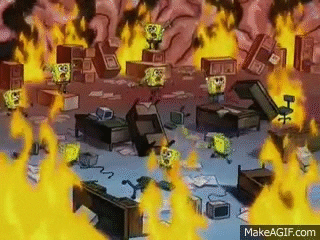
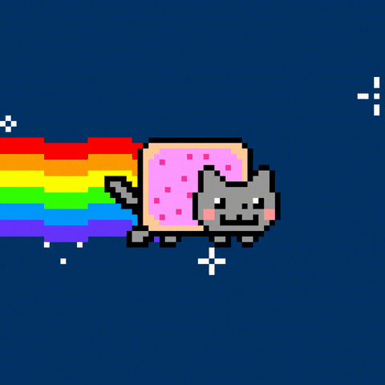

Hey 👋

**What would you do if your main bank had an outage?**

What I mean is, what if you held all your money in one bank account and that bank had an outage...how would you access your money? Answer - **You can’t**….at least not until their systems are back online. So what do you do to prevent an outage from interrupting your life (and your access to money)?

**TL;DR - Spread your money across a few bank accounts (and card networks)**

## Multiple bank accounts

It’s rare for a bank to have an outage but if and when they do and you need access to your money, you’ll want a backup account for such a situation. The majority of current accounts are free and a few banks let you open an online current account within less than an hour. I think it’s a great idea to open up a second bank account and hold a few days worth of spending money in it or at least enough to cover any recurring bills you might have. 

Another thing you might want to do instead would be to split your [emergency fund](/archive/akashandmoney/emergency-funds/)  across two or three bank accounts, to ensure you always have access to some money regardless of if your main bank has an outage.

Here are some examples of outages that have happened in the past:

* TSB, 2018 - [outage for multiple weeks](https://www.theguardian.com/business/2018/jun/06/timeline-of-trouble-how-the-tsb-it-meltdown-unfolded)
* Natwest & RBS, 2019 - [outage on Black Friday](https://www.finextra.com/newsarticle/34871/natwest-and-rbs-down-infuriating-black-friday-online-shoppers)
* Revolut, 2019 - [outage for two and a half hours](https://web.archive.org/web/20220928011612/https://blog.revolut.com/revolut-app-issues-30th-october-what-happened-and-what-we-did-to-fix-it/) 
* Monzo, 2019 - [outage for two hours](https://monzo.com/blog/2019/09/08/why-monzo-wasnt-working-on-july-29th)

Regardless of how long an outage is for, not having access to your money is a horrible feeling. While it’s impossible to know when a bank could have an outage, by being prepared with a backup account, you can be reassured that you’ll have access to some of your money until the outage with your main bank has been resolved.
There’s just one other thing to consider as well when looking into secondary accounts, because… 

## Card networks have outages as well 🙃

Yup. This is something else you’ll also need to consider. If you look at any bank card, you’ll likely see either a Mastercard, Visa or an American Express logo somewhere on it. These are all card networks that work independently of each other and several banks will be using one or the other for their debit and credit cards. 

In 2018 Visa has an outage that caused [5.2 million payments to fail during a 10-hour outage](https://www.finextra.com/newsarticle/32277/visa-says-52m-payments-failed-during-10-hour-outage) and 2.4 million of those payments were in the UK 😬

On that day, Mastercard and American Express cardholders were able to continue using their cards without any major issues. So having a bank card on another card network to your main bank account might just help you out in a tricky situation like this.

Again - This type of outage isn't even that common, but making sure you are ready for it just means you have one less thing to worry about in the future in the chance that an outage does occur.

## Summary

Anyway, the important thing to remember is not to panic when an outage happens and fall back on your other bank account (hopefully also on another card network). 

In the future, we’re likely going to progress into an increasingly more digital financial world. In 2019 alone, more than half of the payments made in the UK were made via a card and in 2020 this trend only accelerated due to the pandemic and increased contactless spending limit in the UK. 

As a last resort, you could also just have a little bit of cash on hand in such situations (as long as you’re not tempted to spend it). 

Not having access to your main account (or any money) can be annoying. At least you can sleep easy at night knowing you didn't spend over [half a million dollars on a Nyan cat gif](https://foundation.app/@NyanCat/foundation/219).

**Till next time!**

