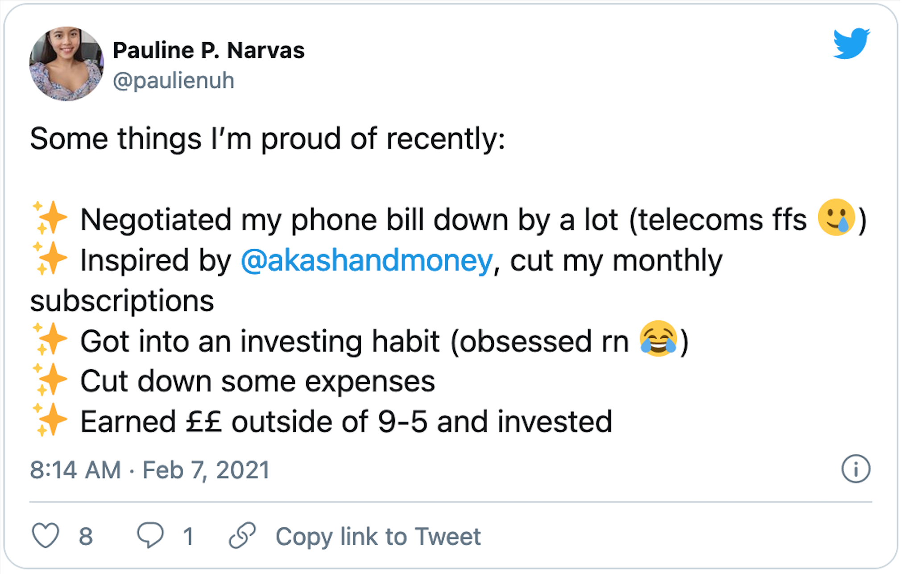
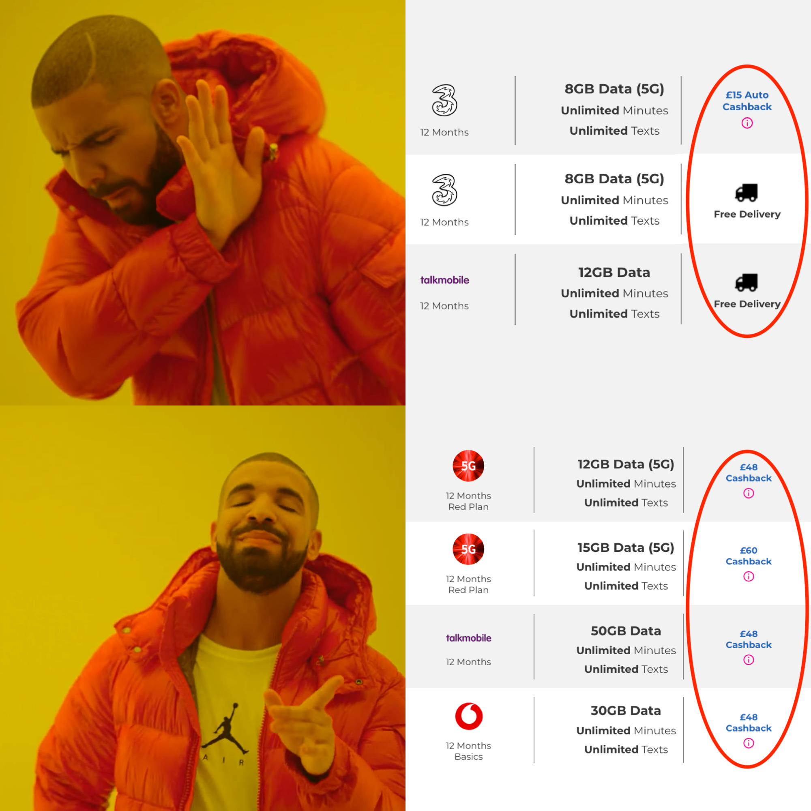
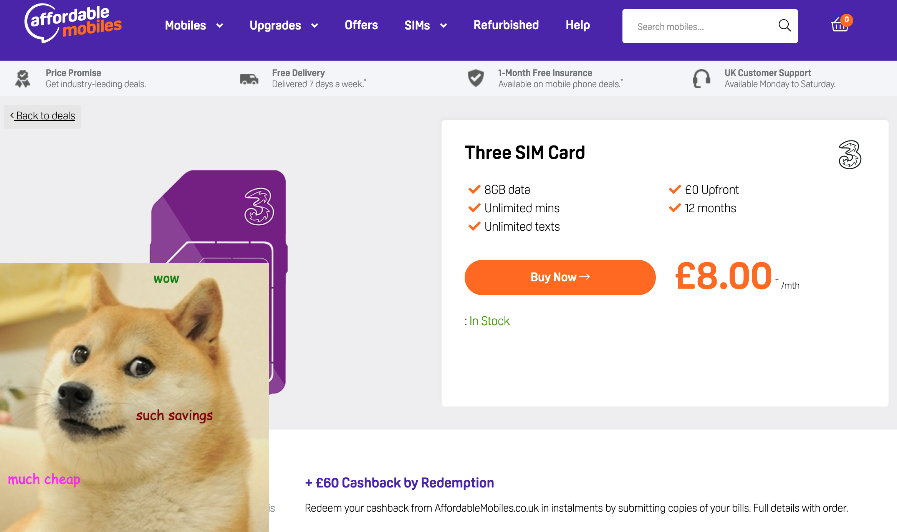

Hey there 👋

Our phones have become an essential tool in our everyday lives. Everything is just a tap away, whether it’s online banking, shopping or ordering a takeaway. For what is an essential tool, you’re likely paying more for your phone or sim plan than you need to. I thought I’d share some of the things I’ve learnt to help keep costs low 📉

**TL;DR - Check if changing your phone contract/sim plan can save you money at least once a year**

## A success story! 🙌

Before going further, I wanted to share a success story from a reader that made some changes to her finances after reading my last newsletter issue! [Pauline shared how she spent a weekend reading more about personal finance](https://twitter.com/paulienuh/status/1358325455447879684) and as a result, has now negotiated her phone bill down and cut out some subscriptions she no longer needs. She’s told me that due to these changes she now **saves an extra £538 a year!**

 

Well done Pauline 👏

## Contracts are spendy 💸

While we don’t pay as much as folks in America (who pay around an average of $101.50 a month!) we’re still spending a considerable amount on phones. In 2018, Money Saving Expert found that *four million mobile phone users are paying up to £38 extra for their phones/contracts* without realising it and it’s partly to do it with how fixed contact deals work. 

At the end of a contact, most network providers will roll you onto a 30-day plan where everything stays the same including the price. This isn’t great because fixed-term contracts include the price of the phone in the plan. At the end of the term, you’d have paid the phone off but by not changing your plan you could still end up paying for a phone you’ve already paid off 😱

Last year, a handful of network providers have committed to moving customers to lower-priced plans at the end of a contract term automatically to save them some money however, some network providers (*cough cough*, Three, EE and Vodafone 🙄) have declined to offer this, leaving it up to customers to remember switching to a cheaper deal.

You can use the tips I’ve previously discussed on how to [haggle with your broadband provider](/archive/akashandmoney/busting-broadband-bills) with network providers as well if you want to stay with the same one at the end of your contact. 

Personally, I buy my phone outright while sticking to sim only plans and hang onto my phone for three to four years before replacing it. There are also a few other things I did over the years to help keep costs low...

## Switch to a virtual network operators/sim only plan 🔄

Virtual network operators are companies that lease network usage from the main network providers and usually have sim plans that are a lot cheaper than those offered by the main network providers. You’ve likely heard of a few of them already such as GiffGaff, Lyca Mobile and Virgin Mobile just to name a few and there are some newer (and interesting) ones popping up like Voxi and Zevvle. 

[Voxi](https://www.voxi.co.uk/) has been a favourite of mine in the past due to it’s unique ‘Endless Social Media’ perk that comes with all its sim plans. Another great benefit of virtual networks is that a lot of the sim only plans offer flexibility. They are mostly 30-day sim plans which give you the freedom to switch to a better deal later on if you wanted. Most virtual network providers tend to also offer the standard fixed-price phone contracts (again, usually for less) if you aren’t ready to switch over to a sim only deal yet.

**Fun Fact** - Virtual networks are getting more popular in the US and one virtual network provider ‘Mint Mobile’ is partly owned by Ryan Reynolds...

 
 
## Cashback sim only plans 🤑

I’ve found this one only recently but I’m surprised by how simple and cost-effective it is! 

Some websites offer cashback on their sim only contract plans so you can end up with an amazing deal that can cost less than a tenner a month. My current sim plan is from a website called [Fonehouse](https://www.fonehouse.co.uk/) and I've managed to get a sim only contract with unlimited minutes and texts with 60GBs of data for just **£7.50 a month!** 

**Ok, but what’s the catch?**

The catch is that ***you have to claim this cashback manually*** in certain months after getting your sim plan and a majority of people will likely forget to do this. Fonehouse has a great [blog post](https://www.fonehouse.co.uk/blog/how-does-redemption-cashback-work/) explaining how their cashback redemption works, and if you do it correctly the money is paid directly into your bank account. 

I was sceptical at first, but I've gotten two out of my three cashback payments so far. In the meantime, while you wait for your cashback you do pay the full price of the contact each month (mine is £20 a month) so remember to submit those cashback claims. If you set up some reminders for yourself ahead of time you should have no issues with this. 

Fonehouse offers a few different ‘extras’ on sim only plans. You can select ‘Auto Cashback’ plans if you don’t want to deal with submitting your monthly bills to receive your cashback but the amount of cashback on these plans are lower than the standard cashback plans. Additionally, all the sim plans come with free delivery so the offer of 'free delivery' isn't really an 'extra'. 

Here's a simple diagram that summaries what you want to look for in addition to the monthly price👇

 
 
Outside of dedicated cashback websites, I’ve only seen one other website that offers cashback on sim only contracts - [Affordable Mobiles](https://www.affordablemobiles.co.uk/). 
 
The ‘Guaranteed Cashback’ is paid to you automatically and the manual cashback offers are labelled as ‘Cashback by Redemption’. I haven’t used their website myself so I’m not too familiar with their cashback process but according to [their help article](https://www.affordablemobiles.co.uk/help/cashback), the process looks to be similar to claim your cashback. While they don’t have as many cashback offers they have some surprisingly cheap sim only plans. 

 

👆This offer ends up being just *£3 a month* when the cashback is taken into consideration!
 
### Further Reading/Watching 📽

* [Millions pay up to £38/mth for a phone they already own](https://www.moneysavingexpert.com/news/2018/09/millions-overpay-for-mobiles/)
* [Three, EE and Vodafone will continue to overcharge customers for mobile contracts](https://www.which.co.uk/news/article/three-ee-and-vodafone-will-continue-to-overcharge-customers-for-mobile-contracts-heres-how-to-save-aB4uN7k9sA0l) 
* [Why Do Cell Phone Bills Cost So Much In The U.S.?](https://www.youtube.com/watch?v=6CU3g0X4yF0) 

Using this information above I’ve managed to cut my phone bill down from £15 a month to just £7.50 (after cashback). I'm also working on a way to drop that down further to £0 a month, but that's a story for another time. Why not see how much you can save as well using these tips and tricks 😃